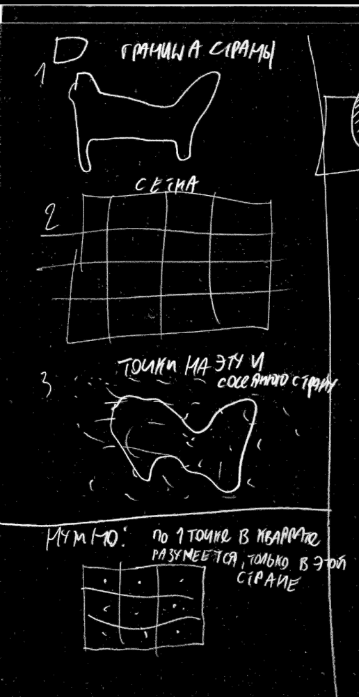
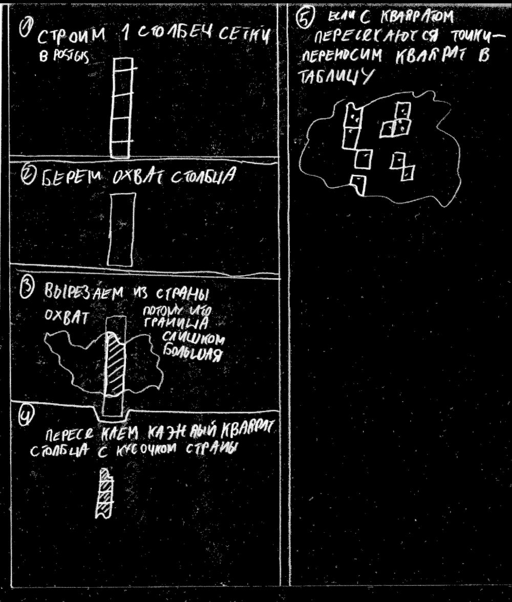

# Выгрузка POI по США с сеткой

# На входе: 
* source/List of Tags (OpenStreetMap) HillaryDonald App (1).xlsx - таблица нужных тегов с приоритетом. Если приоритет=0, то такие POI не нужны.
* Граница США в базе

Краткое описание алгоритма:
На территорию США генерируется сетка 1x1 миля. Для каждого квадрата берётся случайная точка POI из OSM с приоритетом 3. Если таких нет, то 2, если таких нет - то 1.
На выходе - слой с точками, слой с сеткой.

убрать state national_park
размер полигона: миля*0.666
добавить старбаксы из https://opendata.socrata.com/Business/All-Starbucks-Locations-in-the-World-Point-Map/7sg8-44ed?_ga=1.93541853.1197251441.1365557881
старбаксы по территории США добавляются в базу POI перед отбором по сетке.
После отбора в итоговую таблицу POI добавляются все остальные Старбаксы с остального мира

# Usage:

``
time python main.py
``

Для запуска разных частей алгоритма вручную - закомментировать вручную вызовы в файле main.py.  
Код лежит в process.py
Скопировать config.example.py в config.py, ввести туда параметры доступа к БД 
Часть структуры базы - в dump.sql Лучше один раз создать таблицы с индексами и последовательностями, и потом при повторных запусках скрипта им делать TRUNCATE, чем DROP; CREATE TABLE
Добавить osm_id с буквами: n,p

ogr2ogr -f "PostgreSQL" PG:"host=192.168.250.1 dbname=processing_osm_ch3 user=trolleway password=" "source/starbucks.geojson" -nln starbucks  -nlt point -overwrite
#Этот файл взят из https://opendata.socrata.com/Business/All-Starbucks-Locations-in-the-World-Point-Map/7sg8-44ed?_ga=1.93541853.1197251441.1365557881, но из него удалены некоторые поля

# Более детальные описания фрагментов алгоритма

## Импорт списка тегов

Из csv список нужных тегов импортируется в PostGIS. Потом из этой таблицы генерируются строки для sql-запросов и osmfilter

## Импорт OSM

1. Выгружается osm.pbf - по Северной америке: США+Канада
2. .pbf > .o5m вместе с --drop-author
3. o5m фильтруется по списку тегов. 
4. o5m > pbf
5. pbf > osm2pgsql c кастомным стилем - special.style

Это наиболее быстрый способ импорта: если просто загнать pbf с кастомным стилем в osm2pgsql, то импорт занимает 48 часов. А с такой предварительной фильтрацией файла - 1 час 5 минут.

## Обработка

Отдельно в таблицу boundary импортируется полигон границы страны из OSM вручную c https://mapzen.com/data/borders/

В базе он правится вручную из qgis
Там должна быть одна фича

